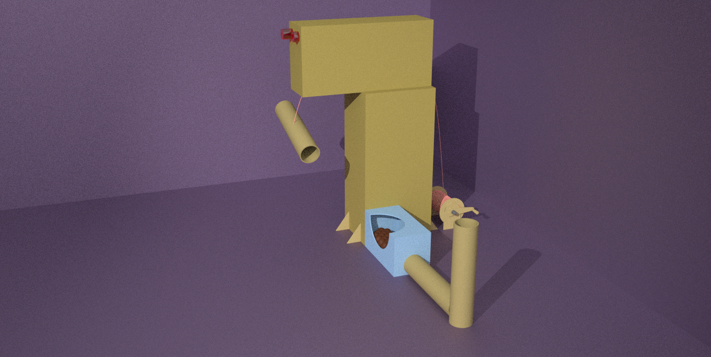

<!doctype html>
<html>
<head>
<meta charset="UTF-8">
<title>Dog Distractor</title>
<link href="style.css" rel="stylesheet" type="text/css">
</head>

<body>

	

	
	 
	 
	 
	 
	 <a1 {text-align: center;} href="earlydesigns.html" class="early"><a href="earlydesigns.html">Early Designs</a></a1>
	 <a1 {text-align: center;} href="happydogs.html" class="happy"><a href="happydogs.html">Happy Dogs</a></a1>
	<a1 {text-align: center;} href="about.html" class="about"><a href="about.html">About</a></a1>
	 
	 
	 
	 
	 
	 
	 
	 
	<audio id="myAudio">
		<source src="Audio/dog bark.wav" type="audio/wav" >
	</audio>
	<audio id="Audio">
		<source src="Audio/dog sniffing.wav" type="audio/wav" >
	</audio>
	 
	         
	                       
	
	
 The Dog Distractor Original Design© 2022 

	
	
	
	
	
	
	
</body>
</html>
